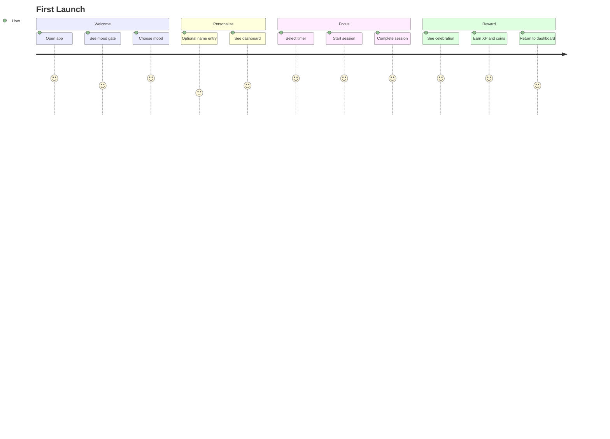
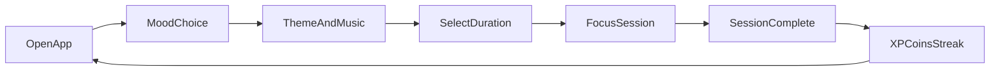
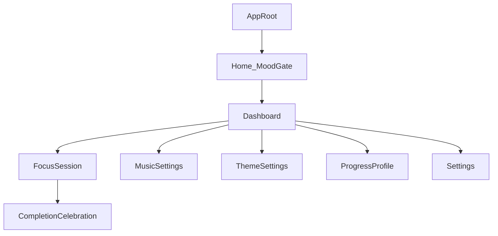
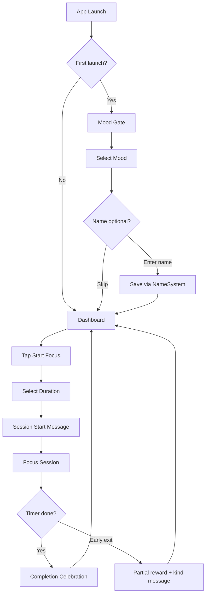
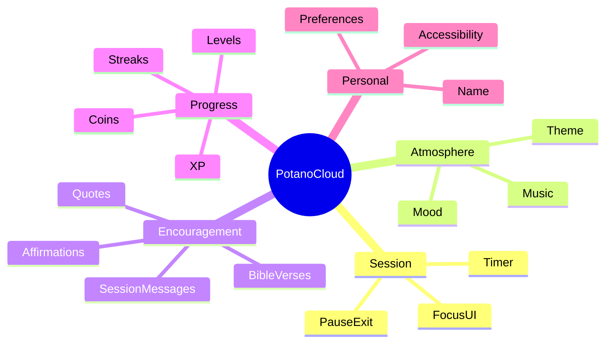
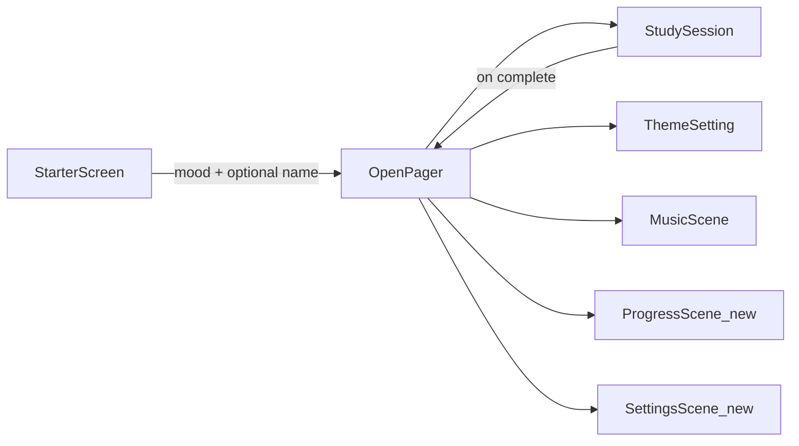
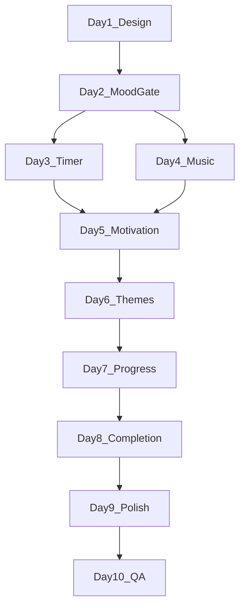

# Potano Cloud — Unity Product Design Plan

**Version:** 1.0  
**Date:** June 22, 2026  
**Platform:** Unity 6 (6000.3.0f1) · 2D · Android + Windows PC  
**Status:** Pre-development design phase  
**Codebase:** [Assets/Scenes/](../Assets/Scenes/) · [Assets/Scripts/StudyAppScripts/](../Assets/Scripts/StudyAppScripts/)

---

## Table of Contents

1. [Product Vision](#1-product-vision)
2. [Target Audience](#2-target-audience)
3. [User Personas](#3-user-personas)
4. [User Journey](#4-user-journey)
5. [Core Gameplay Loop](#5-core-gameplay-loop)
6. [Screen Hierarchy](#6-screen-hierarchy)
7. [User Flow](#7-user-flow)
8. [Information Architecture](#8-information-architecture)
9. [UI/UX Design Plan](#9-uiux-design-plan)
10. [Theme Design Specifications](#10-theme-design-specifications)
11. [Color Palette Recommendations](#11-color-palette-recommendations)
12. [Typography Recommendations](#12-typography-recommendations)
13. [Accessibility Considerations](#13-accessibility-considerations)
14. [Reward System Design](#14-reward-system-design)
15. [XP System Design](#15-xp-system-design)
16. [Music System Design](#16-music-system-design)
17. [Motivation System Design](#17-motivation-system-design)
18. [Data Architecture](#18-data-architecture)
19. [Scene Architecture](#19-scene-architecture)
20. [Folder Structure](#20-folder-structure)
21. [Development Roadmap](#21-development-roadmap)
22. [MVP Definition](#22-mvp-definition)
23. [Stretch Goals](#23-stretch-goals)
24. [Risks and Scope Control](#24-risks-and-scope-control)

---

## 1. Product Vision

### Mission

Potano Cloud is a calm, encouraging 2D study companion that helps students and people with ADHD focus, stay motivated, and build sustainable study habits through positive reinforcement — never guilt or punishment.

### Product Promise

> *"You showed up. That counts."*

Every interaction should make the user feel welcomed, capable, and in control. The app meets users where they are emotionally and adapts the atmosphere around them.

### Brand Voice

| Do | Don't |
|---|---|
| Warm, gentle, affirming | Demanding, guilt-based, shaming |
| Celebrate small wins | Compare to others or ideal standards |
| Offer choices, never force | Overwhelm with options or dense text |
| Use plain language | Use jargon or productivity buzzwords |

### Design Principles

1. **One decision per screen** — Reduce choice paralysis; guide users step by step.
2. **Visible progress** — Streaks, XP, and session counts are always accessible, never hidden.
3. **Optional depth** — Core loop works in under 10 seconds; settings and customization are available but never required.
4. **Mood-first entry** — Emotional state drives theme, music, and encouragement before any other input.
5. **No punishment** — Missed days, early exits, and short sessions are met with kindness, not loss.

### Success Metrics (Post-Launch)

- Session completion rate ≥ 70%
- Day-7 retention ≥ 40%
- Average session length aligns with chosen timer (low early-exit rate)
- Settings engagement (theme/music changes) indicates personalization without overwhelm

---

## 2. Target Audience

### Primary Audience

**Students (ages 16–24)** experiencing focus challenges during study — high school through early college. They use mobile devices frequently, respond to gamification, and need short, achievable focus blocks.

### Secondary Audience

**Adults (ages 25–40) with ADHD** who find traditional productivity apps overwhelming. They value calm aesthetics, ambient music, and apps that do not punish missed days.

### Platform Context

| Platform | Input | Layout priority |
|---|---|---|
| **Android** (mobile-first) | Touch, thumb-zone CTAs | Portrait, bottom navigation, safe-area insets |
| **Windows PC** | Mouse, keyboard | Resizable window, left-rail navigation, hover states |

### User Context

- Study sessions happen in bedrooms, libraries, commutes, and shared spaces.
- Sessions are often interrupted; the app must handle pause and early exit gracefully.
- Users may have sensory sensitivities — motion, sound, and visual density must be controllable.

---

## 3. User Personas

### Persona 1: Alex — The Procrastinating Student

| Attribute | Detail |
|---|---|
| **Age** | 19, college sophomore |
| **Goal** | Finish assignments without last-minute panic |
| **Pain** | Opens laptop, gets distracted, feels guilty, avoids studying |
| **Needs** | Short timers (5–10 min), streak motivation, low-friction start |
| **Mood default** | Motivate Me on deadline days; Calm Me otherwise |
| **Quote** | *"If I can just start for 5 minutes, maybe I'll keep going."* |

### Persona 2: Jordan — The Overwhelmed Professional

| Attribute | Detail |
|---|---|
| **Age** | 28, certification student + full-time job |
| **Goal** | Study after work without mental exhaustion |
| **Pain** | Complex planners feel like another job; guilt when skipping days |
| **Needs** | Calm visuals, ambient music, no punishment for missed streaks |
| **Mood default** | Calm Me |
| **Quote** | *"I don't need another app judging me. I need something gentle."* |

### Persona 3: Sam — The Encouraged Learner

| Attribute | Detail |
|---|---|
| **Age** | 16, high school junior |
| **Goal** | Build consistent study habits with positive reinforcement |
| **Pain** | Loses motivation quickly; needs visible rewards |
| **Needs** | XP, coins, streaks, Bible verses, celebratory completion screens |
| **Mood default** | Encourage Me |
| **Quote** | *"Seeing my streak go up actually makes me want to come back."* |

---

## 4. User Journey

### First Launch Journey



**Steps:**

1. App opens → full-screen mood gate: *"Ready to focus for a bit?"*
2. User taps one of three mood cards (Calm / Encourage / Motivate).
3. App applies mood defaults (music category, message tone).
4. Optional: user picks background theme and brother/sister character (skippable — defaults to Modern Classic).
5. Optional: user enters name for personalized greetings (skippable).
6. Dashboard appears with streak, XP bar, and prominent **Start Focus** button.
7. User selects timer duration (5, 10, 15, or 25 minutes).
8. Focus session begins — minimal UI, chosen theme background with character, ambient music.
9. Session completes → celebration screen with coins, XP, encouragement message.
10. User returns to dashboard; streak and totals update.

### Returning User Journey

1. App opens → dashboard directly (mood gate shown only if user taps "Change mood").
2. Last mood, theme, and music preferences restored.
3. Streak and progress visible immediately.
4. One tap to **Start Focus** → timer select → session.

### Edge Journeys

| Scenario | Experience |
|---|---|
| Missed a day | Streak resets softly; message: *"Welcome back! Every session is a fresh start."* Longest streak preserved. |
| Early session exit | Partial coins/XP for minutes completed; no penalty message. |
| First session of the day | Bonus coin; slightly enhanced celebration animation. |
| Bible verses disabled | Encouragement pool excludes verse content; quotes and affirmations remain. |

---

## 5. Core Gameplay Loop



### Loop Description

| Phase | User action | System response |
|---|---|---|
| **Open** | Launch app | Load saved preferences; show dashboard or mood gate |
| **Mood** | Choose Calm / Encourage / Motivate | Set music category, message tone |
| **Prepare** | Select timer, optionally adjust music/theme | Apply atmosphere; show session-start message |
| **Focus** | Study while timer counts down | Ambient music, minimal UI, optional mid-session nudge at 50% |
| **Complete** | Timer reaches zero (or user ends early) | Award XP + coins; update streak; show encouragement |
| **Return** | Tap Done | Return to dashboard; progress visible |

### Anti-Patterns (Explicitly Avoided)

- No lives, energy bars, or cooldown timers between sessions.
- No red warnings for broken streaks.
- No leaderboards or social comparison.
- No notifications shaming inactivity (stretch: gentle opt-in reminders only).

---

## 6. Screen Hierarchy



### Navigation Depth Rules

- **Maximum depth to start a session:** 2 taps from dashboard (Start Focus → duration → go).
- **Maximum top-level nav items:** 4 (Home, Focus, Progress, Settings).
- **No nested menus** deeper than 2 levels in MVP.

### Screen Inventory

| Screen | Scene (existing) | Purpose |
|---|---|---|
| Mood Gate | `StarterScreen` | First-launch and mood-change entry |
| Dashboard | `OpenPager` | Hub: progress summary, start focus, nav |
| Timer Select | Overlay on `OpenPager` or `StudySession` | Choose 5/10/15/25 min |
| Focus Session | `StudySession` | Active timer, music, minimal UI |
| Completion | Overlay or sub-state of `StudySession` | Rewards + encouragement |
| Music Settings | `MusicScene` | Category, volume, mute |
| Theme Settings | `ThemeSetting` | 4 background themes + brother/sister character choice |
| Progress | New: `ProgressScene` (or extend `OpenPager`) | Streak, totals, level, history |
| Settings | New: `SettingsScene` or panel | Preferences, toggles, about |

---

## 7. User Flow

### Flow A: First Launch → First Session



### Flow B: Quick Session (Returning User)

1. Open app → Dashboard.
2. Tap **Start Focus**.
3. Tap duration (defaults to last-used duration).
4. Session begins immediately.

### Flow C: Change Mood Mid-Day

1. Dashboard → tap current mood badge or **Change mood**.
2. Mood gate overlay appears.
3. Select new mood → theme/music/message tone update.
4. Return to dashboard.

### Flow D: Mute Music

1. During session → tap mute icon (top corner).
2. Music stops; preference saved for session.
3. Unmute restores previous volume.

### Flow E: View Streak and Progress

1. Dashboard → **Progress** tab.
2. View: current streak, longest streak, total sessions, total focus minutes, XP level, coin balance.
3. Optional: last 7 sessions list (MVP: count only; history list is stretch).

### Flow F: Choose Background Theme and Character

1. Dashboard → tap **Theme** (or open `ThemeSetting`).
2. Preview grid shows 4 theme cards: Modern Classic, Artsy Skies, Bright Spectrum, Autumn Warmth.
3. User taps a theme → background preview updates.
4. User taps **Brother** or **Sister** → character in preview swaps.
5. Selection saves automatically; return to dashboard.

---

## 8. Information Architecture

### Content Domains



### Navigation Model

| Mobile (Android) | PC (Windows) |
|---|---|
| Bottom tab bar: Home · Focus · Progress · Settings | Left rail: same 4 items |
| Full-screen modals for timer select and completion | Centered panels with max-width 480px for focus UI |
| Thumb-zone primary CTA at bottom | Primary CTA centered or left-aligned in content area |

### Content Hierarchy (Dashboard)

1. **Primary:** Start Focus CTA
2. **Secondary:** Current streak + XP bar
3. **Tertiary:** Mood badge, last session summary, music/theme shortcuts
4. **Hidden until needed:** Settings, name edit, Bible verse toggle

### Labeling Conventions

- Use verbs for actions: *Start Focus*, *Change mood*, *Done*.
- Use nouns for destinations: *Progress*, *Settings*, *Music*.
- Avoid abbreviations except universally understood ones (XP).

---

## 9. UI/UX Design Plan

### Layout System

- **Grid:** 8pt base unit; margins 16pt mobile / 24pt tablet-PC.
- **Spacing scale:** 8, 16, 24, 32, 48, 64.
- **Corner radius:** 12pt cards, 24pt mood cards, 50% circular timer ring.
- **Elevation:** Subtle shadows on cards (Modern Classic); soft painterly edges (Artsy Skies); flat bold panels (Bright Spectrum); warm depth (Autumn Warmth).

### Touch and Click Targets

| Element | Minimum size |
|---|---|
| Primary CTA | 56 × 56 dp |
| Secondary button | 48 × 48 dp |
| Icon button (mute, back) | 48 × 48 dp |
| Mood card | Full width, min height 120 dp |
| Timer duration chip | 80 × 56 dp |

### One Primary Action Per Screen

| Screen | Primary action |
|---|---|
| Mood Gate | Select a mood |
| Dashboard | Start Focus |
| Timer Select | Confirm duration |
| Focus Session | (Passive — timer runs; exit is secondary) |
| Completion | Done |
| Settings | (No single primary — save is automatic) |

### Screen Wireframes

#### 1. Mood Gate

```
┌─────────────────────────────────┐
│                                 │
│   Ready to focus for a bit?     │
│                                 │
│  ┌───────────────────────────┐  │
│  │  🌿  Calm Me              │  │
│  │  Soft & peaceful          │  │
│  └───────────────────────────┘  │
│  ┌───────────────────────────┐  │
│  │  ✨  Encourage Me         │  │
│  │  Gentle support           │  │
│  └───────────────────────────┘  │
│  ┌───────────────────────────┐  │
│  │  🔥  Motivate Me          │  │
│  │  Energized focus          │  │
│  └───────────────────────────┘  │
│                                 │
│         Skip for now →          │
└─────────────────────────────────┘
```

#### 2. Dashboard

```
┌─────────────────────────────────┐
│  🔥 5-day streak    Lv.3  ⭐120 │
│  ████████░░░░  XP to next level │
│                                 │
│  Hi, Alex!  [Calm Me 🌿]        │
│                                 │
│       ┌─────────────────┐       │
│       │  START FOCUS    │       │
│       └─────────────────┘       │
│                                 │
│  Last session: 15 min · +15 🪙   │
│                                 │
│  [🎵 Music]  [🎨 Theme]         │
├─────────────────────────────────┤
│  Home  │ Focus │ Progress │ ⚙️  │
└─────────────────────────────────┘
```

#### 3. Timer Select

```
┌─────────────────────────────────┐
│  ← Back                         │
│                                 │
│  How long today?                │
│                                 │
│   [ 5 ]   [ 10 ]                │
│   [ 15 ]  [ 25 ]                │
│                                 │
│       ┌─────────────────┐       │
│       │     Begin       │       │
│       └─────────────────┘       │
└─────────────────────────────────┘
```

#### 4. Focus Session

```
┌─────────────────────────────────┐
│  🔇                    [Exit]   │
│                                 │
│         ╭───────────╮           │
│         │           │           │
│         │   14:32   │           │
│         │           │           │
│         ╰───────────╯           │
│                                 │
│   "Be still and know..."        │
│                                 │
│         [ Pause ]               │
└─────────────────────────────────┘
```

#### 5. Completion

```
┌─────────────────────────────────┐
│                                 │
│           ✨ Nice work!         │
│                                 │
│         +15 🪙  +18 XP          │
│                                 │
│  ┌───────────────────────────┐  │
│  │ "You showed up today.     │  │
│  │  That already matters."   │  │
│  └───────────────────────────┘  │
│                                 │
│       ┌─────────────────┐       │
│       │      Done       │       │
│       └─────────────────┘       │
└─────────────────────────────────┘
```

#### 7. Theme Settings

```
┌─────────────────────────────────┐
│  ← Back        Choose Your Look │
│                                 │
│  Pick a background              │
│  ┌────┐ ┌────┐ ┌────┐ ┌────┐   │
│  │Mod │ │Sky │ │Bright│ │Aut│   │
│  │ern │ │Artsy│ │     │ │umn│   │
│  └────┘ └────┘ └────┘ └────┘   │
│                                 │
│  Choose your character          │
│     [ Brother ]  [ Sister ]     │
│                                 │
│  ┌───────────────────────────┐  │
│  │     (live preview)        │  │
│  │   character + background  │  │
│  └───────────────────────────┘  │
│                                 │
│       ┌─────────────────┐       │
│       │      Save       │       │
│       └─────────────────┘       │
└─────────────────────────────────┘
```

#### 8. Settings

```
┌─────────────────────────────────┐
│  Settings                       │
│                                 │
│  Theme          [Modern Classic ▼] │
│  Character      [Brother | Sister]  │
│  Bible verses   [ON]            │
│  Gamification   [ON]            │
│  Reduced motion [OFF]           │
│  High contrast  [OFF]           │
│                                 │
│  Your name      [Alex    ✎]     │
│                                 │
│  ─────────────────────────────  │
│  About Potano Cloud             │
└─────────────────────────────────┘
```

### Motion and Feedback

- **Session complete:** Subtle particle burst (theme-colored); coin/XP count-up animation (0.8s).
- **Level up:** Brief full-screen badge reveal; auto-dismiss after 2s.
- **Reduced motion mode:** Disable particles; instant reward numbers; no parallax.
- **Haptics (Android):** Light tap on session complete; optional in Settings.

### Existing Code Alignment

| Current script | UX role |
|---|---|
| `NameSystem` | Optional name on first launch; greeting on dashboard |
| `RealTimeInfor` | Date/time widget on dashboard (optional) |
| `EventsDisplay` | Future: session history list on Progress screen |
| `ThemeSelector` (`QuestionFunction`) | 4 theme buttons (`themeButton1`–`4`) + brother/sister character toggle on `ThemeSetting` |

---

## 10. Theme Design Specifications

Background themes are **independent from mood**. Mood (Calm / Encourage / Motivate) controls music and motivational messages. The user chooses their **background theme** and **character** (brother or sister) as personal visual preference — available anytime on `ThemeSetting` or in Settings.

Each of the four themes includes paired **brother** and **sister** character art integrated into the background scene. Both characters are styled to feel equally welcome; the Autumn Warmth theme in particular uses inclusive, gender-neutral-friendly styling so all users feel represented.

### Theme Overview

| # | Theme | Color direction | Visual language | Characters |
|---|---|---|---|---|
| **1** | **Modern Classic** | Blue, green, red, white | Clean, balanced, contemporary study space | Brother & sister in modern casual outfits |
| **2** | **Artsy Skies** | Soft sky blues, lavender, cloud white | Painterly clouds, open horizon, creative calm | Brother & sister gazing at stylized sky |
| **3** | **Bright Spectrum** | Vivid, high-energy primaries and secondaries | Bold blocks of color, playful and uplifting | Brother & sister in energetic, colorful poses |
| **4** | **Autumn Warmth** | Amber, rust, golden yellow, deep orange | Cozy fall leaves, warm light, inviting tone | Brother & sister in autumn setting — designed for girls and boys equally |

### Theme 1: Modern Classic

- **Background:** Layered scene using blue, green, red, and white — balanced modern palette (colorful but orderly).
- **Character placement:** Brother or sister seated at a clean desk or window nook; subtle idle animation (optional, post-MVP).
- **UI accents:** Primary blue buttons, green success states, red sparingly for emphasis, white surfaces.
- **Particles:** None or very subtle (MVP).
- **Best for:** Users who want a familiar, polished look without fantasy or extreme brightness.

### Theme 2: Artsy Skies

- **Background:** Illustrated sky — gradients from horizon to cloud layer, soft brush-stroke or watercolor feel.
- **Character placement:** Brother or sister silhouetted against the sky; open, airy composition.
- **UI accents:** Sky blue and soft lavender; semi-transparent white cards.
- **Particles:** Slow-drifting cloud wisps (low count).
- **Best for:** Users who find open skies calming and creatively inspiring.

### Theme 3: Bright Spectrum

- **Background:** Very bright, saturated color fields — cheerful and high-energy without clutter.
- **Character placement:** Brother or sister in dynamic, friendly pose; bold outline style for clarity on bright backgrounds.
- **UI accents:** High-contrast white or dark text on vivid panels; timer ring uses complementary bright accent.
- **Particles:** Optional soft sparkles; respect reduced-motion toggle.
- **Best for:** Users who need visual energy and positivity to stay engaged.

### Theme 4: Autumn Warmth

- **Background:** Autumn palette — golden leaves, warm amber light, rust and orange tones.
- **Character placement:** Brother and sister variants in cozy fall clothing (scarves, sweaters); warm, approachable expressions.
- **Inclusivity:** Both character options styled with equal prominence; no theme labeled as “for girls” or “for boys” — user simply picks brother or sister.
- **UI accents:** Amber and deep orange timer ring; cream text on warm brown surfaces.
- **Particles:** Gentle falling leaves (3–5 on screen max).
- **Best for:** Users who prefer warmth, coziness, and seasonal comfort.

### Character Selection (Brother / Sister)

- **Where:** `ThemeSetting` scene and Settings panel.
- **Behavior:** Selecting brother or sister swaps the character illustration within the **currently active background theme** — theme and character are independent choices.
- **Persistence:** Saved via `PlayerPrefs` (`CharacterChoice`: brother / sister).
- **Code alignment:** Maps to commented `ladieBTN` / `manBTN` placeholders in [`ThemeSelector.cs`](../Assets/Scripts/StudyAppScripts/ThemeSelector.cs) — refactor to brother/sister toggle alongside `themeButton1`–`themeButton4`.

### Theme Application Scope

When a theme is active, these elements update:

- Full-screen **background** illustration or gradient (primary user choice)
- **Character** illustration (brother or sister variant for that theme)
- Button and chip **accent colors** derived from theme palette
- Timer ring color and glow
- Particle effects (if enabled and theme supports them)
- Celebration particle colors

**Not changed by theme:** Mood selection, music category (unless user changes it separately), XP/coin logic, message tone.

### Mood vs. Theme (Separate Systems)

| System | User control | Affects |
|---|---|---|
| **Mood** | Calm / Encourage / Motivate | Music category default, motivational message tone |
| **Background theme** | User's free choice (4 options) | Background art, character scene, UI accent colors |
| **Character** | Brother or Sister | Which character appears in the active theme |

Mood does **not** auto-override the user's chosen background theme. On first launch, show a one-time theme picker after mood selection (skippable — defaults to Modern Classic + brother).

---

## 11. Color Palette Recommendations

### Semantic Tokens (Shared)

| Token | Purpose | Example value |
|---|---|---|
| `--bg-primary` | Main background | Theme-specific |
| `--bg-surface` | Cards, panels | Theme-specific |
| `--text-primary` | Headlines, body | #1A1A2E or #FFFFFF on dark |
| `--text-muted` | Secondary text | 60% opacity of primary |
| `--accent-calm` | Calm Me highlights | #5B8C5A |
| `--accent-encourage` | Encourage Me highlights | #4A90D9 |
| `--accent-motivate` | Motivate Me highlights | #D4A853 |
| `--success` | Completion states | #4CAF50 |
| `--xp-gold` | XP and coins | #FFD54F |
| `--error-soft` | Rare validation only | #E57373 (never for streak break) |

### Modern Classic Palette

| Role | Hex | Contrast on white |
|---|---|---|
| Background blue | #4A90D9 | — |
| Background green | #5B8C5A | — |
| Background red (accent) | #E57373 | — |
| Surface | #FFFFFF | — |
| Text primary | #212529 | 15.8:1 ✓ |
| Accent | #4A90D9 | 4.5:1 ✓ |
| Timer ring | #5B8C5A | — |

### Artsy Skies Palette

| Role | Hex | Contrast on light |
|---|---|---|
| Sky top | #B8D4E8 | — |
| Sky horizon | #E8D4F0 | — |
| Cloud white | #FAFAFA | — |
| Surface | #FFFFFFCC | — |
| Text primary | #2C3E50 | 11.2:1 ✓ |
| Accent | #7B9ACC | 4.6:1 ✓ |
| Timer ring | #6B9BD1 | — |

### Bright Spectrum Palette

| Role | Hex | Contrast |
|---|---|---|
| Background primary | #FF6B6B | — |
| Background secondary | #4ECDC4 | — |
| Background tertiary | #FFE66D | — |
| Surface | #FFFFFF | — |
| Text primary | #1A1A2E | 14.5:1 ✓ on white |
| Accent | #FF6B6B | — |
| Timer ring | #4ECDC4 | — |

### Autumn Warmth Palette

| Role | Hex | Contrast on dark |
|---|---|---|
| Background top | #D4A853 | — |
| Background bottom | #8B4513 | — |
| Leaf rust | #C4622D | — |
| Surface | #5C3D2E | — |
| Text primary | #FFF8E7 | 14.2:1 ✓ |
| Accent | #E8923A | 7.8:1 ✓ |
| Timer ring | #D4A853 | — |

All text pairings target **WCAG 2.1 AA** minimum (4.5:1 normal text, 3:1 large text).

---

## 12. Typography Recommendations

### Font Stack

| Role | Font | Fallback | Rationale |
|---|---|---|---|
| **Headings** | Nunito | Quicksand, system sans | Rounded, friendly, low anxiety |
| **Body** | Inter | Open Sans, system sans | Excellent legibility at small sizes |
| **Timer** | Inter (tabular nums) | — | Clear, monospaced digit alignment |

### Type Scale

| Token | Size (mobile) | Size (PC) | Weight | Use |
|---|---|---|---|---|
| `display` | 32sp | 40sp | Bold | Mood gate headline |
| `h1` | 24sp | 28sp | SemiBold | Screen titles |
| `h2` | 20sp | 24sp | SemiBold | Section headers |
| `body` | 16sp | 16sp | Regular | Body text |
| `body-small` | 14sp | 14sp | Regular | Captions, metadata |
| `timer` | 64sp | 96sp | Bold | Countdown display |
| `encouragement` | 20sp | 24sp | Medium | Quote cards (max 40 chars/line) |

### Rules

- Line height: 1.5× for body; 1.2× for headings.
- Max line length on encouragement cards: 40 characters (mobile).
- Never use all-caps for sentences; title case for buttons only.
- Timer digits: enable OpenType tabular figures in TMP font asset.

---

## 13. Accessibility Considerations

### ADHD-Specific

| Requirement | Implementation |
|---|---|
| Reduce cognitive load | One primary action per screen; max 4 nav items |
| Large buttons | 48dp minimum, 56dp primary CTAs |
| Minimize text | Short labels; encouragement in bite-sized cards |
| Avoid clutter | Hide secondary options behind Settings |
| No punishment | Soft streak reset copy; no red warning states |
| Small wins | Reward any completed time; partial credit on early exit |
| Visible progress | XP bar and streak always on dashboard |

### Universal Access

| Feature | Detail |
|---|---|
| **Screen reader** | `accessibilityLabel` on all buttons; announce timer milestones |
| **Reduced motion** | Toggle disables particles, parallax, count-up animations |
| **High contrast** | Optional mode increases text/surface contrast per theme |
| **Color independence** | Icons + text accompany all color-coded states |
| **Font scaling** | Support OS font scale up to 1.3× without layout break |
| **Touch targets** | 48dp minimum with 8dp spacing between targets |
| **Audio** | Mute always visible during session; volume persists |
| **Haptics** | Optional; off by default on PC |

### Testing Checklist

- [ ] VoiceOver / TalkBack navigation through full session loop
- [ ] 200% display zoom usable on Android
- [ ] Keyboard-only navigation on Windows (Tab, Enter, Escape)
- [ ] Color contrast audit per theme (WebAIM or similar)
- [ ] Reduced motion: no essential info conveyed only through animation

---

## 14. Reward System Design

### Currency: Coins

| Event | Coins earned |
|---|---|
| Per minute completed | 1 coin/min (floor) |
| Session bonus (any completion) | +2 coins |
| First session of the day | +5 bonus coins |
| Early exit | Coins for minutes completed only; no penalty |

**Coins are never deducted.** Missing days, broken streaks, and early exits do not reduce coin balance.

### Celebration Tiers (Animation Only)

| Duration | Animation intensity | Message tone |
|---|---|---|
| 5 min | Small sparkle, 0.5s | *"Every minute counts."* |
| 10 min | Medium burst, 0.8s | *"You stayed with it."* |
| 15 min | Fuller celebration, 1.0s | *"Solid focus today."* |
| 25 min | Full celebration, 1.2s | *"Impressive dedication."* |

Shorter sessions are not lesser — copy always affirms the effort.

### Spend (Stretch Goal — Post-MVP)

Coins accumulate in MVP. Future shop items:

- Theme variant backgrounds (seasonal editions per theme)
- Timer ring skins
- Celebration particle styles
- Profile badges (display only)

### Gamification Toggle

Users can disable gamification in Settings:

- Hides XP bar, coins, streak, and celebration animations.
- Focus timer and music remain fully functional.
- Messages still appear; only numeric rewards hidden.

---

## 15. XP System Design

### Earning XP

```
XP = duration_minutes × mood_multiplier (rounded down)

Mood multipliers:
  Calm Me:      1.0
  Encourage Me: 1.1
  Motivate Me:  1.2
```

| Session | Calculation | XP |
|---|---|---|
| 10 min, Calm | 10 × 1.0 | 10 |
| 15 min, Encourage | 15 × 1.1 | 16 |
| 25 min, Motivate | 25 × 1.2 | 30 |

Early exit: XP for minutes completed at same multiplier. No negative XP ever.

### Level Curve

| Level | XP required (cumulative) | Unlock (stretch) |
|---|---|---|
| 1 | 0 | Default messages |
| 2 | 50 | — |
| 3 | 120 | Badge: "Getting Started" |
| 4 | 220 | New quote pack |
| 5 | 350 | Badge: "Consistent" |
| 6+ | +50% of previous threshold | Rotating cosmetics |

Gentle curve — level 2 reachable in ~5 short sessions.

### Display

- **Dashboard:** XP bar with "Lv. X" badge and progress to next level.
- **Completion screen:** "+N XP" with count-up animation.
- **Level up:** Brief overlay; no blocking modal.

### Streak Integration

- Streak is independent of XP — maintained by completing ≥1 session per calendar day (any duration).
- Streak break: current streak resets to 0; longest streak preserved and displayed.
- Streak milestones (3, 7, 14, 30 days): bonus XP lump (+10, +25, +50, +100) and special message.

---

## 16. Music System Design

### Categories

| Category | Mood mapping | Character |
|---|---|---|
| **Peace** | Calm Me | Ambient, nature sounds, soft piano, 60–70 BPM |
| **Hope** | Encourage Me | Uplifting instrumental, light strings, 70–85 BPM |
| **Motivation** | Motivate Me | Energetic but not distracting, 85–100 BPM |
| **Mute** | Any | Silence |

### User Controls

- Play / pause
- Volume slider (0–100%, default 70%)
- Category selector (Peace / Hope / Motivation)
- Mute toggle (persists across sessions)

### Technical Approach (Unity)

- **AudioManager** (singleton, `DontDestroyOnLoad`): manages playback across scenes.
- **ScriptableObject** track lists: `MusicCategorySO` with `AudioClip[]` per category.
- **Crossfade:** 1.5s between tracks when playlist advances.
- **Loop:** Shuffle or sequential loop within category.
- **Persistence:** `PlayerPrefs` keys: `MusicCategory`, `MusicVolume`, `MusicMuted`.

### Scene Mapping

- `MusicScene` — full music settings UI.
- Dashboard — shortcut button to `MusicScene`.
- Focus session — mute icon only (minimal chrome).

### Future: Custom Music (Stretch)

- File picker (Android SAF) or `StreamingAssets/UserMusic/` folder on PC.
- Separate "My Music" playlist slot; does not replace built-in categories.

### Platform Notes

| Platform | Note |
|---|---|
| Android | In-app audio only for MVP; no background playback |
| Windows | Standard `AudioSource` playback; respect system volume |

---

## 17. Motivation System Design

### Content Pools

| Pool ID | When shown | Mood weighting |
|---|---|---|
| `session_start` | Timer begins | Filtered by mood |
| `session_complete` | Timer ends | Filtered by mood |
| `mid_session` | 50% elapsed (optional) | Filtered by mood |
| `streak_milestone` | Streak hits 3/7/14/30 | Neutral |
| `bible_verse` | Any slot (if enabled) | Calm + Encourage weighted |
| `quote` | Any slot | All moods |
| `welcome_back` | First session after streak break | Neutral |

### Mood → Message Tone

| Mood | Tone keywords |
|---|---|
| Calm Me | Peace, rest, gentleness, presence |
| Encourage Me | Affirmation, capability, grace, progress |
| Motivate Me | Action, strength, purpose, energy |

### Sample Messages (MVP minimum: 20 per pool)

**Session start — Calm Me:**
- *"Take a breath. You're here, and that's enough to begin."*
- *"No rush. Just this moment."*

**Session complete — Encourage Me:**
- *"You showed up today. That already matters."*
- *"Small steps still move you forward."*

**Bible verse — example:**
- *"Be still, and know that I am God." — Psalm 46:10*

### Rules

- No repeat within last 10 messages (per pool).
- Bible verses: separate tagged content; user disables via Settings (`bibleVersesEnabled`).
- Display: single card, large text; optional swipe for another (post-MVP).
- All content stored in JSON or ScriptableObjects under `Assets/Data/Motivation/`.

### Data Format (JSON example)

```json
{
  "id": "calm_start_01",
  "pool": "session_start",
  "moods": ["calm"],
  "text": "Take a breath. You're here, and that's enough to begin.",
  "type": "affirmation"
}
```

---

## 18. Data Architecture

### Persistence Strategy

**MVP:** `PlayerPrefs` — aligns with existing `NameSystem` and `EventsSystem` patterns.

**V2 migration path:** Export to JSON file in `Application.persistentDataPath` or SQLite for session history.

### Data Models

#### UserProfile

| Field | Type | PlayerPrefs key | Notes |
|---|---|---|---|
| name | string | `StudentName` (existing) | Optional |
| lastMood | enum | `LastMood` | calm / encourage / motivate |
| lastTheme | enum | `LastTheme` | modernClassic / artsySkies / brightSpectrum / autumnWarmth |
| characterChoice | enum | `CharacterChoice` | brother / sister |
| lastDuration | int | `LastDuration` | 5, 10, 15, or 25 |
| gamificationEnabled | bool | `GamificationOn` | Default true |
| hasCompletedOnboarding | bool | `OnboardingDone` | Skip mood gate on return |

#### ProgressData

| Field | Type | PlayerPrefs key |
|---|---|---|
| totalSessions | int | `TotalSessions` |
| totalFocusMinutes | int | `TotalFocusMinutes` |
| currentStreak | int | `CurrentStreak` |
| longestStreak | int | `LongestStreak` |
| lastSessionDate | string (ISO) | `LastSessionDate` |
| xp | int | `XP` |
| level | int | `Level` |
| coins | int | `Coins` |

#### Preferences

| Field | Type | PlayerPrefs key |
|---|---|---|
| musicCategory | enum | `MusicCategory` |
| musicVolume | float | `MusicVolume` |
| musicMuted | bool | `MusicMuted` |
| reducedMotion | bool | `ReducedMotion` |
| highContrast | bool | `HighContrast` |
| bibleVersesEnabled | bool | `BibleVersesOn` |

#### SessionRecord (V2 — array in JSON)

| Field | Type |
|---|---|
| date | datetime |
| durationMinutes | int |
| mood | enum |
| theme | enum |
| xpEarned | int |
| coinsEarned | int |
| completedFully | bool |

### Streak Logic

```
On session complete:
  today = current calendar date
  if lastSessionDate == yesterday:
    currentStreak += 1
  else if lastSessionDate == today:
  else:
    currentStreak = 1  // reset; show welcome_back message if previous streak > 0

  longestStreak = max(longestStreak, currentStreak)
  lastSessionDate = today
```

### Existing Script Mapping

| Script | Data responsibility |
|---|---|
| `NameSystem` | `UserProfile.name`, onboarding flow |
| `EventsSystem` | Future: user-defined study goals (`Event_0`…`Event_n` keys) |
| `EventsDisplay` | Future: render session history |
| `ThemeSelector` | `UserProfile.lastTheme`, `UserProfile.characterChoice` read/write |
| New: `SaveManager` | Centralized load/save for all `ProgressData` and `Preferences` |

### SaveManager Responsibilities (Planned)

- Single entry point: `SaveManager.Load()` on app start, `SaveManager.Save()` on state change.
- Wraps `PlayerPrefs` with typed accessors.
- Fires events on progress update for UI binding.

---

## 19. Scene Architecture

### Scene Flow



### Scene Details

| Scene | File | Scripts | MVP status |
|---|---|---|---|
| **StarterScreen** | `Assets/Scenes/StarterScreen.unity` | `NameSystem` (refactor), new `MoodSelector` | Refactor |
| **OpenPager** | `Assets/Scenes/OpenPager.unity` | `RealTimeInfor`, new `DashboardUI` | Refactor |
| **StudySession** | `Assets/Scenes/StudySession.unity` | New `TimerSystem`, `FocusSessionUI` | Build |
| **ThemeSetting** | `Assets/Scenes/ThemeSetting.unity` | `ThemeSelector` (rename class) | Build |
| **MusicScene** | `Assets/Scenes/MusicScene.unity` | New `MusicSystem` | Build |
| **ProgressScene** | New scene | `EventsDisplay` (implement) | New |
| **SettingsScene** | New scene or panel | New `SettingsUI` | New |
| **TaskSession** | `Assets/Scenes/TaskSession.unity` | `EventsSystem` | Stretch |
| **TimeTable** | `Assets/Scenes/TimeTable.unity` | — | Stretch |
| **GameScene** | `Assets/Scenes/Gameplay/GameScene.unity` | — | Evaluate: merge into Progress or deprecate |

### Load Strategy

**MVP:** Full scene swap via `SceneManager.LoadScene` (matches existing `NameSystem.OnBeginButtonClicked` pattern).

**Post-MVP:** Consider additive loading for completion overlay only.

### Build Settings Order

1. `StarterScreen` (index 0 — launch scene for first-time users)
2. `OpenPager`
3. `StudySession`
4. `ThemeSetting`
5. `MusicScene`
6. `ProgressScene`
7. `SettingsScene`

*Launch logic: if `OnboardingDone`, load `OpenPager` directly from bootstrap.*

### Bootstrap Option

Add a lightweight `Bootstrap` scene (index 0) that checks `OnboardingDone` and routes to `StarterScreen` or `OpenPager`. Optional for MVP — can use `StarterScreen` with conditional logic in `NameSystem` refactor.

---

## 20. Folder Structure

### Proposed `Assets/` Organization

```
Assets/
├── Scenes/
│   ├── StarterScreen.unity
│   ├── OpenPager.unity
│   ├── StudySession.unity
│   ├── ThemeSetting.unity
│   ├── MusicScene.unity
│   ├── ProgressScene.unity          (new)
│   ├── SettingsScene.unity          (new)
│   ├── TaskSession.unity            (stretch)
│   └── TimeTable.unity              (stretch)
│
├── Scripts/
│   ├── Core/
│   │   ├── GameManager.cs
│   │   ├── SceneLoader.cs
│   │   └── SaveManager.cs
│   ├── UI/
│   │   ├── MoodSelectorUI.cs
│   │   ├── DashboardUI.cs
│   │   ├── TimerUI.cs
│   │   ├── ProgressUI.cs
│   │   ├── CompletionUI.cs
│   │   └── SettingsUI.cs
│   ├── Systems/
│   │   ├── TimerSystem.cs
│   │   ├── MusicSystem.cs
│   │   ├── MotivationSystem.cs
│   │   ├── XpSystem.cs
│   │   └── StreakSystem.cs
│   ├── Data/
│   │   ├── UserProfile.cs
│   │   ├── ProgressData.cs
│   │   ├── Preferences.cs
│   │   ├── MusicCategorySO.cs
│   │   └── MotivationMessageSO.cs
│   └── StudyAppScripts/             (legacy — migrate then deprecate)
│       ├── NameSystem.cs
│       ├── ThemeSelector.cs
│       ├── EventsSystem.cs
│       ├── EventsDisplay.cs
│       └── RealTimeInfor.cs
│
├── Art/
│   ├── Themes/
│   │   ├── ModernClassic/
│   │   │   ├── Backgrounds/
│   │   │   ├── CharacterBrother/
│   │   │   └── CharacterSister/
│   │   ├── ArtsySkies/
│   │   ├── BrightSpectrum/
│   │   └── AutumnWarmth/
│   ├── UI/
│   └── Icons/
│
├── Audio/
│   └── SFX/
│
├── Music/
│   ├── Peace/
│   ├── Hope/
│   └── Motivation/
│
├── Data/
│   └── Motivation/
│       ├── session_start.json
│       ├── session_complete.json
│       ├── bible_verses.json
│       └── quotes.json
│
├── Prefabs/
│   ├── UI/
│   └── Systems/
│
├── Resources/                       (fallback assets)
│
└── DocMd/                           (this document)
    ├── README.md
    └── Potano-Unity-Product-Design-Plan.md
```

### Migration Notes

- Move logic from `StudyAppScripts/` into `Core/`, `UI/`, `Systems/` incrementally during roadmap Days 2–8.
- Rename `QuestionFunction` class in `ThemeSelector.cs` to `ThemeSelector` on Day 6.
- Keep `StudyAppScripts/` until migration complete to avoid breaking scene references.

---

## 21. Development Roadmap

### 10-Day Schedule

| Day | Focus | Tasks | Deliverable |
|---|---|---|---|
| **1** | Design + wireframes | Finalize this document; sketch 6 core screens | Approved design spec |
| **2** | Mood gate + onboarding | Refactor `StarterScreen`; implement `MoodSelectorUI`; mood → defaults; optional name (refactor `NameSystem`) | Mood-first entry works |
| **3** | Focus timer | Build `TimerSystem` in `StudySession`; 4 durations; pause; early exit (partial reward) | Complete timer loop |
| **4** | Music system | `MusicSystem` singleton; `MusicScene` UI; category playback; mute; volume persist | Music plays across scenes |
| **5** | Motivation system | JSON content pools; `MotivationSystem`; start/complete cards; Bible toggle | Messages show per mood |
| **6** | Theme system | 4 background themes + brother/sister characters; `ThemeSetting` functional; wire `themeButton1`–`4` in `ThemeSelector` | Themes and characters swap globally |
| **7** | XP + coins + streaks | `SaveManager`, `XpSystem`, `StreakSystem`; dashboard widgets | Progress persists |
| **8** | Completion flow | `CompletionUI`; celebration animations; return to `OpenPager` | Full loop playable |
| **9** | Platform polish | Android safe areas; PC resolution scaling; input; build both targets | APK + Windows build |
| **10** | QA + MVP freeze | Bug fixes; content pass (20 msgs/pool); MVP checklist | Shippable MVP |

### Daily Success Criteria

- **Day 2:** User can select mood and reach dashboard in &lt;15 seconds.
- **Day 3:** User can complete a 5-minute test session with countdown visible.
- **Day 4:** Music plays during session and survives scene load.
- **Day 5:** Different messages appear for different moods.
- **Day 6:** All 4 themes and brother/sister character variants visibly change background and accents.
- **Day 7:** Streak increments on consecutive days in test; XP and coins persist after restart.
- **Day 8:** Full loop: mood → timer → focus → reward → dashboard without errors.
- **Day 9:** Builds run on physical Android device and Windows PC.
- **Day 10:** MVP checklist 100% pass.

### Dependency Graph



---

## 22. MVP Definition

### In Scope

- [ ] Mood gate with 3 moods (Calm / Encourage / Motivate)
- [ ] Mood affects music category and message tone (not background theme)
- [ ] Optional name personalization (skippable)
- [ ] Focus timer: 5, 10, 15, 25 minutes
- [ ] Pause and early exit with partial rewards
- [ ] 4 background themes: Modern Classic, Artsy Skies, Bright Spectrum, Autumn Warmth
- [ ] Brother / sister character choice per theme
- [ ] 3 music categories: Peace, Hope, Motivation + mute
- [ ] Motivation messages at session start and complete
- [ ] Bible verses (toggle off in Settings)
- [ ] XP system with levels
- [ ] Coin earning (no spending UI)
- [ ] Daily streak with soft reset
- [ ] Session completion celebration
- [ ] Gamification toggle (hide rewards)
- [ ] Reduced motion toggle
- [ ] PlayerPrefs persistence
- [ ] Android APK build
- [ ] Windows PC build

### Out of Scope (MVP)

- Custom user music import
- Task/calendar planning (`TaskSession`, `TimeTable`)
- Cloud sync / user accounts
- Cosmetic shop / coin spending
- Push notifications
- Session history list (counts only on Progress screen)
- Achievement badge collection UI
- Localization
- Background audio on Android

### MVP Acceptance Criteria

1. New user can complete a full focus session in under 60 seconds of onboarding.
2. Returning user can start a session in 2 taps.
3. No guilt-based copy anywhere in the app.
4. Progress (XP, coins, streak) persists after app restart.
5. App runs at 60 FPS on mid-range Android (API 24+).
6. All interactive elements meet 48dp touch target minimum.

---

## 23. Stretch Goals

Prioritized for post-MVP releases:

| Priority | Feature | Effort | Value |
|---|---|---|---|
| P1 | Custom music import | Medium | High personalization |
| P1 | Cosmetic reward shop | Medium | Coin sink; motivation |
| P2 | Weekly study calendar (`TimeTable`) | High | Planning for power users |
| P2 | Session history list | Low | Progress visibility |
| P2 | Achievement badges | Medium | Gamification depth |
| P3 | Android home screen widget | High | Quick-start convenience |
| P3 | Export focus stats (CSV) | Low | Data portability |
| P3 | Localization (i18n) | High | Broader audience |
| P3 | Gentle opt-in reminders | Medium | Re-engagement without guilt |
| P4 | `TaskSession` study goals | Medium | Event system reuse |
| P4 | Cloud sync | Very high | Multi-device |

### Reuse from Existing Scenes

- `EventsSystem` + `TaskSession` → study goal reminders.
- `TimeTable` → weekly calendar view.
- `GameScene` → mini-celebration sandbox or badge gallery.

---

## 24. Risks and Scope Control

### Risk Register

| Risk | Likelihood | Impact | Mitigation |
|---|---|---|---|
| 10-day timeline too aggressive | High | High | Ruthless MVP scope; defer shop, calendar, custom music |
| Content creation bottleneck | Medium | Medium | Ship with 20 messages per pool; expand weekly post-launch |
| Theme art scope creep (4 themes × 2 characters) | Medium | High | MVP: gradient backgrounds + simple character silhouettes; full illustrations in stretch |
| `PlayerPrefs` data loss on reinstall | Low | Medium | Document v2 JSON migration; acceptable for MVP |
| Android audio lifecycle issues | Medium | Medium | In-app only; `DontDestroyOnLoad` AudioManager; test on device Day 9 |
| Script naming drift (`QuestionFunction`) | Low | Low | Rename to `ThemeSelector` on Day 6; update scene refs |
| ADHD overwhelm from gamification | Medium | High | Gamification toggle; subtle UI; no flashing rewards |
| Scope creep from `TaskSession`/`TimeTable` | High | High | Explicitly marked stretch; not in 10-day roadmap |
| Solo developer burnout | Medium | High | Daily clear deliverable; skip polish before core loop works |
| Bible content sensitivity | Low | Medium | Toggle off by default in some regions; respectful, non-preachy tone |

### Scope Control Rules

1. **Core loop first** — No work on Progress UI until timer completes end-to-end.
2. **Content minimum** — 20 messages per pool is enough to ship; perfection is enemy of done.
3. **Art minimum** — Solid color gradients + free icon pack beats unfinished illustrations.
4. **One platform per feature** — Build and test Android + PC on Day 9 only; develop in Editor until then.
5. **No new scenes after Day 7** — Feature freeze on scene count; polish existing only.
6. **Daily demo** — End each day with a playable build, however rough.

### Decision Log

| Decision | Rationale | Date |
|---|---|---|
| Mood-first, not name-first | Reduces ADHD onboarding friction | 2026-06-22 |
| PlayerPrefs for MVP | Matches existing code; zero setup | 2026-06-22 |
| Full scene swap over additive | Simpler; matches `NameSystem` pattern | 2026-06-22 |
| Coins earn-only in MVP | Shop is stretch; avoid half-built economy | 2026-06-22 |
| No punishment mechanics | Core product value proposition | 2026-06-22 |
| 4 character-based background themes | User picks background + brother/sister; independent of mood | 2026-06-22 |

---

## Appendix A: MVP Checklist (Printable)

```
[ ] Mood gate — 3 moods selectable
[ ] Optional name — skippable
[ ] Dashboard — streak, XP, Start Focus
[ ] Timer — 5/10/15/25 min
[ ] Pause / early exit — partial reward, kind message
[ ] Music — 3 categories + mute, persists
[ ] Themes — 4 backgrounds + brother/sister character swap
[ ] Messages — start + complete, mood-filtered
[ ] Bible verses — toggle in Settings
[ ] XP + level — earns and persists
[ ] Coins — earn, no spend
[ ] Streak — daily, soft reset
[ ] Completion — celebration + Done
[ ] Settings — gamification, motion, Bible toggles
[ ] Android build — runs on device
[ ] Windows build — runs on PC
[ ] No guilt copy — full text audit pass
```

---

## Appendix B: Glossary

| Term | Definition |
|---|---|
| **Mood** | User's emotional intent: Calm, Encourage, or Motivate |
| **Theme** | Background visual choice: Modern Classic, Artsy Skies, Bright Spectrum, or Autumn Warmth |
| **Character** | Brother or sister illustration shown within the active theme |
| **Session** | One focus timer run from start to completion or early exit |
| **Streak** | Consecutive calendar days with ≥1 completed session |
| **Soft reset** | Streak returns to 0 without punishment message or coin loss |

---

*End of document. Next step: Day 2 implementation — Mood Gate refactor on `StarterScreen`.*
