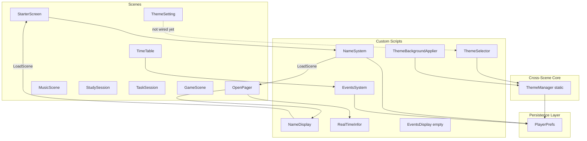
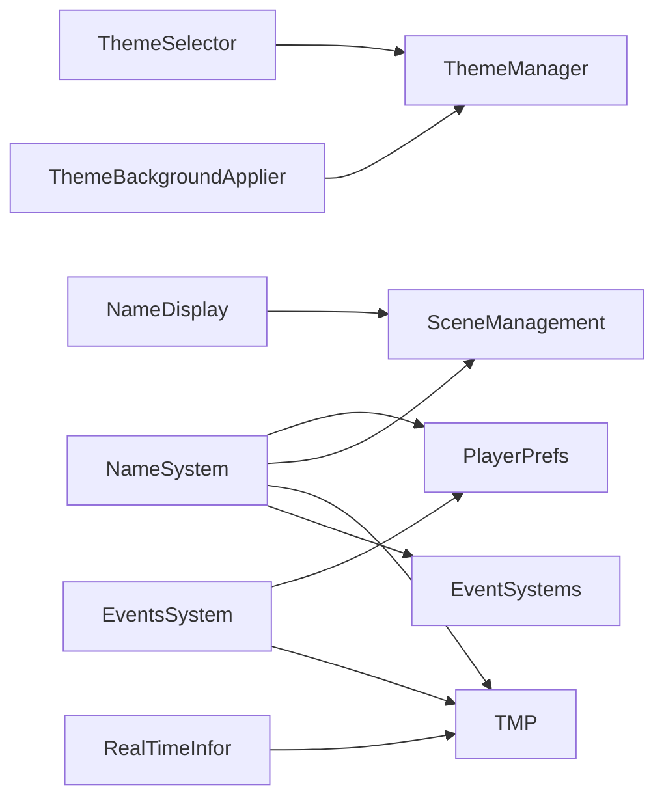
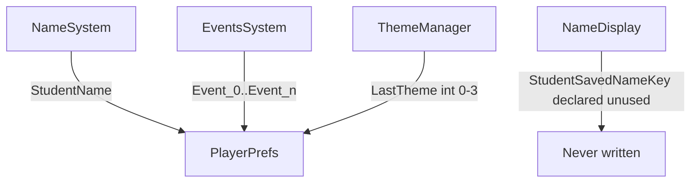

# Potano Cloud — Project Architecture Analysis

**Generated:** June 22, 2026  
**Unity version:** 6000.3.0f1  
**Scope:** All custom scripts under `Assets/Scripts/` (9 files). TextMesh Pro example scripts (33 files) excluded — third-party demos, not application code.

**Related:** [Product Design Plan](Potano-Unity-Product-Design-Plan.md) · [DocMd Index](README.md)

---

## 1. Project Architecture Overview

### High-Level Summary

Potano Cloud is an early-stage Unity 6 **2D UGUI + TextMesh Pro** study companion app. Architecture is **scene-centric and monolithic**: each feature area is a separate scene with MonoBehaviour scripts wired directly to UI elements in the Inspector. There is no central `GameManager`, no service layer, and no shared data layer beyond scattered `PlayerPrefs` calls.

The only cross-scene coordination implemented today is the **theme system** (`ThemeManager` static class + event bus pattern).



### Architectural Style

| Aspect | Current state |
|---|---|
| **Pattern** | Scene-local MonoBehaviours + Inspector wiring |
| **State** | Decentralized `PlayerPrefs` per script |
| **Cross-scene communication** | `SceneManager.LoadScene` only; theme via static events |
| **UI framework** | Unity UGUI (`Image`, `Button`, `Toggle`, `InputField`) + TMP |
| **Render pipeline** | URP 17.3 (`com.unity.render-pipelines.universal`) |
| **Input** | Legacy UI + Input System actions asset referenced in build settings |
| **Build scenes** | `StarterScreen` → `OpenPager` → `ThemeSetting` only |

### Scene Map (8 scenes, 3 in build)

| Scene | In build | Scripts attached | Role |
|---|---|---|---|
| `StarterScreen` | Yes (index 0) | `NameSystem` | Name onboarding gate |
| `OpenPager` | Yes | `NameDisplay`, `RealTimeInfor` | Hub / dashboard shell |
| `ThemeSetting` | Yes | None (theme scripts not attached) | Theme picker UI (4 toggles in scene) |
| `StudySession` | No | None | Planned focus timer |
| `MusicScene` | No | None (`EventsSystem` on buttons only) | Planned music UI |
| `TimeTable` | No | `EventsSystem` | Event slot editor (many buttons) |
| `TaskSession` | No | None | Stub |
| `Gameplay/GameScene` | No | None | Stub |

### Custom Script Inventory

| Script | Type | Lines | Maturity |
|---|---|---|---|
| `ThemeManager.cs` | Static service | 47 | Complete (theme index 0–3) |
| `ThemeSelector.cs` | UI controller | 101 | Complete (needs scene wiring) |
| `ThemeBackgroundApplier.cs` | View component | 51 | Complete (needs per-scene setup) |
| `NameSystem.cs` | UI + save | 112 | Functional, design misaligned |
| `NameDisplay.cs` | UI stub | 24 | Incomplete |
| `EventsSystem.cs` | UI + save | 75 | Partial (TimeTable only) |
| `EventsDisplay.cs` | Empty | 12 | Stub |
| `RealTimeInfor.cs` | UI widget | 50 | Buggy timer logic |

---

## 2. Dependency Map

### Script-to-Script Dependencies



| Script | Depends on | Depended on by |
|---|---|---|
| `ThemeManager` | `PlayerPrefs`, `RuntimeInitializeOnLoadMethod` | `ThemeSelector`, `ThemeBackgroundApplier` |
| `ThemeSelector` | `ThemeManager`, `UnityEngine.UI.Toggle` | None (not in scenes yet) |
| `ThemeBackgroundApplier` | `ThemeManager`, `Image` / `SpriteRenderer` | None (not in scenes yet) |
| `NameSystem` | TMP, EventSystems, SceneManagement, PlayerPrefs | None (direct) |
| `NameDisplay` | TMP, SceneManagement | None |
| `EventsSystem` | TMP, PlayerPrefs | Scene buttons only |
| `EventsDisplay` | Nothing | Nothing |
| `RealTimeInfor` | TMP, `System` | None |

### Script-to-Scene Dependencies

| Script | Required scene objects (SerializeField) | Scenes using it |
|---|---|---|
| `NameSystem` | InputField, 2× TMP text, 4× GameObject refs | `StarterScreen` |
| `NameDisplay` | TMP text, register button (unused) | `OpenPager` |
| `RealTimeInfor` | 3× TMP text (time, date, zone) | `OpenPager` |
| `EventsSystem` | InputField, TMP text, 2× GameObject refs | `TimeTable` (+ button hooks elsewhere) |
| `ThemeSelector` | 4× GameObject or Toggle refs | **None attached** |
| `ThemeBackgroundApplier` | Image/SpriteRenderer + Sprite[4] | **None attached** |

### External / Package Dependencies (application-relevant)

| Package | Used by |
|---|---|
| `com.unity.ugui` | All UI scripts |
| TextMesh Pro | All text UI |
| `UnityEngine.SceneManagement` | `NameSystem`, `NameDisplay` |
| `UnityEngine.EventSystems` | `NameSystem` (selection polling in Update) |

### Naming Collision Risk

| Name | Conflict |
|---|---|
| `EventsSystem` (custom class) | Confusing vs Unity's `EventSystem` component used for UI input |
| `RealTimeInfor` | Typo (`Infor` vs `Info`); inconsistent naming |

---

## 3. Gameplay Systems Summary

Per the [Product Design Plan](Potano-Unity-Product-Design-Plan.md), the intended core loop is: **Mood → Timer → Focus → Reward**. Current code implements almost none of that loop.

| System | Design status | Code status | Scripts |
|---|---|---|---|
| **Mood gate** (Calm / Encourage / Motivate) | Planned | Not implemented | — |
| **Focus timer** (5/10/15/25 min) | Planned | Not implemented | — |
| **Music** (Peace / Hope / Motivation) | Planned | Scene exists, no audio logic | — |
| **Motivation messages** | Planned | Not implemented | — |
| **XP / coins / streaks** | Planned | Not implemented | — |
| **Gamification / rewards** | Planned | Not implemented | — |
| **Background themes** (4 slots) | Planned | **Implemented** | `ThemeManager`, `ThemeSelector`, `ThemeBackgroundApplier` |
| **Name personalization** | Optional in design; required in code | Partial | `NameSystem` |
| **Event / schedule slots** | Stretch goal | Partial CRUD | `EventsSystem` |
| **Session history** | Stretch | Empty stub | `EventsDisplay` |
| **Date/time display** | Dashboard widget | Implemented (buggy) | `RealTimeInfor` |

### What Actually Runs Today

1. **StarterScreen:** User must enter name → saved to `PlayerPrefs` → Begin loads `OpenPager`.
2. **OpenPager:** Static greeting from `NameDisplay`; clock/date from `RealTimeInfor` (updates every frame due to logic bug).
3. **ThemeSetting:** UI toggles exist; `ThemeSelector` not attached — theme selection may not work in Editor until wired.
4. **TimeTable:** Select slot → edit event text → save/clear via `EventsSystem` and `Event_{id}` keys.

---

## 4. UI Systems Summary

### UI Technology Stack

- **Canvas-based UGUI** for all screens
- **TextMesh Pro** for labels, input fields, displays
- **Toggle** components on `ThemeSetting` (4 theme options)
- **Button OnClick** wired in Inspector to public methods (no centralized UI manager)

### UI Controllers by Screen

| Screen | UI behavior | Controller | Notes |
|---|---|---|---|
| **StarterScreen** | Name input, clear, begin, exit | `NameSystem` | Blocks progress until name saved; uses `Update()` to detect button selection |
| **OpenPager** | Greeting text, clock, nav buttons | `NameDisplay`, `RealTimeInfor` | Name not loaded from save; hardcoded start text |
| **ThemeSetting** | 4 toggles, preview images, back button | *None* | Should use `ThemeSelector` + `ThemeBackgroundApplier` |
| **TimeTable** | Grid of event slot buttons, input, save/clear | `EventsSystem` | ~60+ buttons call `SelectButton(int)` |
| **MusicScene** | Buttons reference `EventsSystem` methods | Miswired | Wrong script on music UI |
| **StudySession** | Timer UI (visual only) | None | No script |
| **TaskSession** | Unknown | None | No script |

### UI Patterns Observed

| Pattern | Where | Assessment |
|---|---|---|
| SerializeField wiring | All scripts | Standard Unity; OK for MVP |
| Public methods for OnClick | `NameSystem`, `EventsSystem`, `ThemeSelector` | Good |
| Polling `EventSystem` in `Update` | `NameSystem` | Anti-pattern; use Button.onClick instead |
| Empty Update loops | `EventsDisplay`, old stubs | Dead code |
| No UI state machine | Global | Each scene owns its own flow |

### Theme UI (most complete UI system)

```
User taps Toggle 1–4
    → ThemeSelector.HandleToggleChanged
    → ThemeManager.SetTheme(index)
    → PlayerPrefs "LastTheme"
    → ThemeChanged event
    → ThemeBackgroundApplier.ApplyTheme on each registered background
```

---

## 5. Save System Summary

### Overview

There is **no unified save layer**. Each script reads/writes `PlayerPrefs` independently with hardcoded keys. No `SaveManager`, no schema, no migration, no validation.



### PlayerPrefs Key Registry

| Key | Type | Writer | Reader | Purpose |
|---|---|---|---|---|
| `StudentName` | string | `NameSystem.SaveName` | `NameSystem.LoadName`, `OnBeginButtonClicked` | User display name |
| `LastTheme` | int (0–3) | `ThemeManager.SetTheme` | `ThemeManager.LoadSavedTheme` | Background theme index |
| `Event_{id}` | string | `EventsSystem.SaveEvent` | `EventsSystem.SelectButton` | Per-slot event label (id from button) |

### Keys Declared but Unused / Broken

| Key / constant | Location | Issue |
|---|---|---|
| `StudentSavedNameKey` | `NameDisplay.cs` | Never read or written; `NameSystem` uses `StudentName` instead |
| `NameSystem` reference | `NameDisplay.nameSystem` | Field declared, never assigned or used |

### Save Behavior Details

| Feature | Save trigger | Load trigger | Gaps |
|---|---|---|---|
| Name | On save / begin button via Update poll | `Start()` → `LoadName()` | Required before hub; design says optional |
| Theme | Every toggle change | Before first scene via `[RuntimeInitializeOnLoadMethod]` | Scripts not on scenes yet |
| Events | Manual save button | On slot select | No max id documented; keys unbounded |
| XP, coins, streak, mood, music, settings | — | — | Not implemented |

### Persistence Risks

- Keys are stringly-typed and scattered — easy to typo or duplicate.
- No single source of truth for “has user completed onboarding.”
- `PlayerPrefs` only — data lost on uninstall; no export/backup.
- `EventsSystem` does not validate `currentButtonID` on clear if nothing selected.

---

## 6. Missing Features List

Compared to [MVP Definition](Potano-Unity-Product-Design-Plan.md#22-mvp-definition) and current codebase.

### Critical MVP Gaps

| Feature | Priority | Notes |
|---|---|---|
| Mood gate (Calm / Encourage / Motivate) | P0 | Core UX pivot in design doc |
| Focus timer (5/10/15/25 min) | P0 | `StudySession` scene has no logic |
| Pause / early exit with partial rewards | P0 | — |
| Music system (Peace / Hope / Motivation + mute) | P0 | `MusicScene` exists; no `AudioSource` manager |
| Motivation messages (start / complete) | P0 | No content system |
| Bible verse toggle | P1 | — |
| XP, coins, daily streak | P0 | No progress scripts |
| Session completion celebration | P0 | — |
| Dashboard (Start Focus, progress widgets) | P0 | `OpenPager` is shell only |
| Theme wiring in scenes | P0 | Code exists; not attached in `ThemeSetting` / backgrounds |
| Brother/sister character swap | P1 | Design doc; not in code |
| `SaveManager` / unified persistence | P1 | Design doc specifies; not built |
| Scenes in build settings | P0 | `StudySession`, `MusicScene` not in build |

### Partial / Misaligned

| Feature | Gap |
|---|---|
| Name onboarding | Implemented but **required**; design says optional/skippable |
| `NameDisplay` on hub | Does not show saved name from `StudentName` |
| `EventsSystem` on MusicScene buttons | Wrong script wired to music UI |
| `EventsDisplay` | Empty; session history not started |
| Settings scene | Does not exist |
| Progress scene | Does not exist |

### Stretch (Documented, Not Expected Yet)

- Custom music import  
- Task/calendar (`TaskSession`, `TimeTable` full planner)  
- Cloud sync / accounts  
- Cosmetic shop  
- Push notifications  
- Localization  
- Achievement badges  

---

## 7. Technical Debt List

### High Severity

| Issue | Location | Impact |
|---|---|---|
| **Timer condition inverted** | `RealTimeInfor.Update()` uses `<=` instead of `>=` | Updates every frame + spam `Debug.Log`; should update once per second |
| **Theme scripts not in scenes** | `ThemeSetting`, all backgrounds | Theme feature non-functional in Editor until wired |
| **NameDisplay ignores saved name** | `NameDisplay.Start()` | Hub never greets user by name |
| **Duplicate PlayerPrefs key for name** | `NameDisplay` vs `NameSystem` | Confusion; dead constant `StudentSavedNameKey` |
| **Name required to proceed** | `NameSystem.OnBeginButtonClicked` | Conflicts with mood-first ADHD design |
| **MusicScene wired to EventsSystem** | Scene YAML | Buttons call wrong type; runtime errors or no-ops |
| **No GameManager / scene bootstrap** | Project-wide | No routing for returning users vs first launch |

### Medium Severity

| Issue | Location | Impact |
|---|---|---|
| **Button handling in Update** | `NameSystem.Update()` | Fragile; fires repeatedly while selected; should use onClick |
| **Class name `EventsSystem`** | `EventsSystem.cs` | Confusing alongside Unity `EventSystem` |
| **Typo in class name** | `RealTimeInfor` | Maintainability |
| **Empty MonoBehaviours** | `EventsDisplay` | Dead weight; misleading scene expectations |
| **Commented navigation** | `EventsSystem.NextBTN/PrevioustBTN` | Incomplete scene flow |
| **No null checks on UI refs** | Most scripts | NullReference risk if Inspector not wired |
| **Misleading debug logs** | `RealTimeInfor` | Log noise in production |
| **Unused imports** | `RealTimeInfor` (`Serialization`, `Collections`) | Clutter |

### Low Severity

| Issue | Location | Impact |
|---|---|---|
| **Inconsistent copy / typos** | `EventsSystem`, `NameSystem` UI strings | Polish ("These is nothing", "messgaee") |
| **All scripts in one folder** | `StudyAppScripts/` | Won't scale; see recommended structure |
| **No namespaces** | All custom scripts | Global namespace pollution |
| **No tests** | Project | `com.unity.test-framework` installed but unused |
| **33 TMP example scripts** | `Assets/TextMesh Pro/Examples & Extras/` | Bloat; safe to exclude from builds but clutter project |
| **Build settings incomplete** | `EditorBuildSettings` | Only 3 of 8 scenes enabled |

---

## 8. Recommended Folder Structure

Aligns with [Product Design Plan §20](Potano-Unity-Product-Design-Plan.md#20-folder-structure). Migration can be incremental — move scripts without breaking scene references by keeping meta GUIDs.

```
Assets/
├── Scenes/
│   ├── StarterScreen.unity
│   ├── OpenPager.unity
│   ├── ThemeSetting.unity
│   ├── StudySession.unity
│   ├── MusicScene.unity
│   ├── ProgressScene.unity          ← new
│   ├── SettingsScene.unity          ← new
│   ├── TimeTable.unity              ← stretch
│   └── TaskSession.unity            ← stretch
│
├── Scripts/
│   ├── Core/
│   │   ├── GameManager.cs           ← new: bootstrap, scene routing
│   │   ├── SceneLoader.cs           ← new: typed scene names
│   │   └── SaveManager.cs           ← new: wraps all PlayerPrefs keys
│   │
│   ├── Systems/
│   │   ├── Theme/
│   │   │   ├── ThemeManager.cs      ← move from StudyAppScripts
│   │   │   ├── ThemeSelector.cs
│   │   │   └── ThemeBackgroundApplier.cs
│   │   ├── TimerSystem.cs           ← new
│   │   ├── MusicSystem.cs           ← new
│   │   ├── MotivationSystem.cs      ← new
│   │   ├── XpSystem.cs              ← new
│   │   └── StreakSystem.cs          ← new
│   │
│   ├── UI/
│   │   ├── MoodSelectorUI.cs        ← new
│   │   ├── DashboardUI.cs           ← refactor NameDisplay + hub
│   │   ├── NameEntryUI.cs           ← refactor NameSystem
│   │   ├── TimerUI.cs               ← new
│   │   ├── ProgressUI.cs            ← refactor EventsDisplay
│   │   ├── EventsEditorUI.cs        ← rename EventsSystem
│   │   ├── ClockWidget.cs           ← rename/fix RealTimeInfor
│   │   └── SettingsUI.cs            ← new
│   │
│   ├── Data/
│   │   ├── PlayerPrefsKeys.cs       ← new: constants for all keys
│   │   ├── UserProfile.cs           ← new
│   │   ├── ProgressData.cs          ← new
│   │   └── Preferences.cs           ← new
│   │
│   └── StudyAppScripts/             ← deprecate after migration
│
├── Art/
│   └── Themes/
│       ├── ModernClassic/           ← 4 backgrounds + brother/sister each
│       ├── ArtsySkies/
│       ├── BrightSpectrum/
│       └── AutumnWarmth/
│
├── Audio/
│   ├── Music/                       ← Peace, Hope, Motivation
│   └── SFX/
│
├── Data/
│   └── Motivation/                  ← JSON message pools
│
├── Prefabs/
│   └── UI/
│
└── DocMd/
    ├── README.md
    ├── Potano-Unity-Product-Design-Plan.md
    └── Project-Architecture-Analysis.md   ← this document
```

### Migration Order (Suggested)

1. **Add `PlayerPrefsKeys.cs` + `SaveManager`** — consolidate keys without moving scripts yet.  
2. **Fix hot bugs** — `RealTimeInfor` timer, wire `ThemeSelector` to `ThemeSetting`.  
3. **Move theme scripts** to `Scripts/Systems/Theme/`.  
4. **Rename/refactor** — `EventsSystem` → `EventsEditorUI`, `RealTimeInfor` → `ClockWidget`.  
5. **Add `Core/`** — bootstrap scene or `GameManager` for first-launch routing.  
6. **Remove `StudyAppScripts/`** once scene references updated.

---

## Appendix: Script Reference Cards

### ThemeManager.cs
- **Role:** Static theme index + `ThemeChanged` event + PlayerPrefs `LastTheme`
- **Lifecycle:** Loads before scene load via `RuntimeInitializeOnLoadMethod`

### ThemeSelector.cs
- **Role:** 4 toggle UI → `ThemeManager.SetTheme`
- **Scene status:** Not attached

### ThemeBackgroundApplier.cs
- **Role:** Applies `Sprite[4]` to Image/SpriteRenderer on theme change
- **Scene status:** Not attached

### NameSystem.cs
- **Role:** Name CRUD, gate to `OpenPager`
- **Keys:** `StudentName`

### NameDisplay.cs
- **Role:** Hub text + return to `StarterScreen`
- **Gap:** Does not read `StudentName`

### EventsSystem.cs
- **Role:** Event slot CRUD for TimeTable grid
- **Keys:** `Event_{buttonID}`

### EventsDisplay.cs
- **Role:** None (empty class)

### RealTimeInfor.cs
- **Role:** Live clock/date/timezone TMP display
- **Bug:** Update interval logic inverted

---

*Analysis only — no code was modified. Next recommended step: wire `ThemeSelector` + `ThemeBackgroundApplier` in `ThemeSetting`, fix `RealTimeInfor` timer condition, and add `SaveManager` with shared key constants.*
